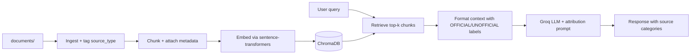

# Project 1 Planning: The Unofficial Guide

> Write this document before you write any pipeline code.
> Your spec and architecture diagram are what you'll use to direct AI tools (Claude, Copilot, etc.) to generate your implementation — the more specific they are, the more useful the generated code will be.
> Update the Retrieval Approach and Chunking Strategy sections if you change your approach during implementation.
> Update this file before starting any stretch features.

---

## Domain

International students navigating CPT, OPT, STEM OPT, and related paperwork face dense official policy that doesn't explain real-world timing, common mistakes, or what peers did when their situation didn't match the FAQ. University ISS pages and government sites state the rules but leave gaps on filing workflow, processing times, and edge cases.

This system deliberately combines two layers of information:
(1) **Official** — university ISS pages and government sources (USCIS, DHS/SEVIS, ICE) for policy and requirements;
(2) **Unofficial** — student-reported experiences from forums, Reddit, and peer guides, plus professional immigration attorney commentary for edge cases official pages omit.

Every answer must identify which layer each claim comes from. Unofficial sources inform practical orientation only; official sources take precedence when they conflict. This guide is informational, not legal or immigration advice.

---

## Source Taxonomy

Every document in the corpus is tagged with exactly one **source type**. This tag is stored as chunk metadata at ingestion and surfaced in every generated response.

### Category 1: Official and Government

**Purpose:** Authoritative policy, eligibility rules, forms, and filing requirements.

**Includes:**

- USCIS, DHS Study in the States, ICE/SEVP, and NAFSA regulatory pages
- University ISS/OIS office web pages and PDF handouts (UNL and peer institutions)

**Trust level:** Highest for *what is required*. May be vague on *how long things take* or *what students actually experience*.

**Subtypes (metadata `source_subtype`):** `government`, `university_iss`

---

### Category 2: Unofficial — Community & Professional Commentary

**Purpose:** Practical filing reality, timelines, mistakes, workarounds, and questions official pages don't answer.

**Includes:**

- Reddit and other student forums (r/intlstudents, r/f1visa, r/OPT, school subreddits)
- Peer blogs and "how I applied" guides
- Immigration attorney blogs (professional commentary — not government policy)

**Trust level:** Useful for *process insight and common pain points*. Never treated as legal or policy authority. May be outdated or school-specific.

**Subtypes (metadata `source_subtype`):** `student_forum`, `attorney_commentary`, `peer_guide`

---

### Source metadata fields (set at ingestion)


| Metadata field   | Allowed values                                                                       | Notes                                  |
| ---------------- | ------------------------------------------------------------------------------------ | -------------------------------------- |
| `source_type`    | `official` | `unofficial`                                                            | Required on every chunk                |
| `source_subtype` | `government`, `university_iss`, `student_forum`, `attorney_commentary`, `peer_guide` | Refines category for response labeling |
| `source_name`    | e.g. "USCIS OPT for F-1", "r/intlstudents thread"                                    | Human-readable label                   |
| `source_url`     | Original URL or file path                                                            | For attribution                        |
| `source_date`    | Publication/post date if known                                                       | Helps flag outdated unofficial advice  |


**Corpus composition:** Tier 1 (USCIS/DHS/ICE/NAFSA) and Tier 2 (university ISS) are tagged `official`. Tier 3 (attorney blogs) and student forums are tagged `unofficial`, with subtype `attorney_commentary` or `student_forum` so the model never presents attorney blogs as government rules or Reddit posts as policy.

**Corpus balance target:** ~40% official government, ~25% university ISS (including UNL when added), ~15% attorney commentary, ~20% student forums.

---

## Documents

Aim for at least 10 sources covering CPT, OPT, STEM OPT, and paperwork — with a **mix of both source types** (minimum 3 official government, minimum 5 unofficial when student sources are added).


| #     | Source                                                              | Source type | Description                                                                                                                                 | URL or location                                                                                                                                                                                                                                                                                                |
| ----- | ------------------------------------------------------------------- | ----------- | ------------------------------------------------------------------------------------------------------------------------------------------- | -------------------------------------------------------------------------------------------------------------------------------------------------------------------------------------------------------------------------------------------------------------------------------------------------------------- |
| 1     | USCIS — OPT for F-1 Students                                        | official    | Core federal guidance on OPT eligibility, types (pre/post-completion), application basics, and work authorization limits for F-1 students.  | [https://www.uscis.gov/working-in-the-united-states/students-and-exchange-visitors/optional-practical-training-opt-for-f-1-students](https://www.uscis.gov/working-in-the-united-states/students-and-exchange-visitors/optional-practical-training-opt-for-f-1-students)                                       |
| 2     | USCIS — STEM OPT Extension                                          | official    | Rules for the 24-month STEM OPT extension, including eligibility, employer requirements, and reporting obligations.                         | [https://www.uscis.gov/working-in-the-united-states/students-and-exchange-visitors/optional-practical-training-extension-for-stem-students-stem-opt](https://www.uscis.gov/working-in-the-united-states/students-and-exchange-visitors/optional-practical-training-extension-for-stem-students-stem-opt)       |
| 3     | USCIS Policy Manual — Vol. 2, Part F, Ch. 5                         | official    | Detailed policy on practical training (CPT/OPT/STEM) — authoritative interpretation of how USCIS applies the rules.                         | [https://www.uscis.gov/policy-manual/volume-2-part-f-chapter-5](https://www.uscis.gov/policy-manual/volume-2-part-f-chapter-5)                                                                                                                                                                                 |
| 4     | DHS Study in the States — F-1 OPT (SEVIS Help Hub)                  | official    | SEVP/SEVIS-oriented OPT overview: student record updates, employment reporting, and OPT mechanics from the DHS student portal.              | [https://studyinthestates.dhs.gov/sevis-help-hub/student-records/fm-student-employment/f-1-optional-practical-training-opt](https://studyinthestates.dhs.gov/sevis-help-hub/student-records/fm-student-employment/f-1-optional-practical-training-opt)                                                         |
| 5     | DHS Study in the States — International Students & Entrepreneurship | official    | DHS guidance on self-employment, startups, and entrepreneurship while on F-1 practical training — fills gaps many ISS pages skip.           | [https://studyinthestates.dhs.gov/international-students-and-entrepreneurship](https://studyinthestates.dhs.gov/international-students-and-entrepreneurship)                                                                                                                                                   |
| 6     | DHS — Form I-983 Overview                                           | official    | Explains the STEM OPT training plan (Form I-983): who completes it, what it must include, and how it ties to the STEM extension.            | [https://studyinthestates.dhs.gov/stem-opt-hub/additional-resources/form-i-983-overview](https://studyinthestates.dhs.gov/stem-opt-hub/additional-resources/form-i-983-overview)                                                                                                                               |
| 7     | USCIS — Form I-765 Instructions (PDF)                               | official    | Official instructions for the Application for Employment Authorization — required documents, fees, photos, and filing details for OPT.      | [https://www.uscis.gov/sites/default/files/document/forms/i-765instr.pdf](https://www.uscis.gov/sites/default/files/document/forms/i-765instr.pdf)                                                                                                                                                             |
| 8     | ICE — OPT "Directly Related to Major" Guidance (PDF)                | official    | ICE/SEVP guidance on what "directly related to the student's major" means for OPT employment — key for job eligibility questions.           | [https://www.ice.gov/doclib/sevis/pdf/optDirectlyRelatedGuidance.pdf](https://www.ice.gov/doclib/sevis/pdf/optDirectlyRelatedGuidance.pdf)                                                                                                                                                                     |
| 9     | NAFSA — 8 CFR 214.2(f) Regulatory Text                              | official    | Underlying federal regulation for F-1 student status and employment — legal baseline behind CPT/OPT rules.                                  | [https://www.nafsa.org/regulatory-information/8cfr2142f](https://www.nafsa.org/regulatory-information/8cfr2142f)                                                                                                                                                                                               |
| 10    | DHS — OPT Unemployment Counter                                      | official    | Explains the 90-day (standard OPT) and 150-day (STEM) unemployment limits and how unemployment days are counted in SEVIS.                   | [https://studyinthestates.dhs.gov/sevis-help-hub/student-records/fm-student-employment/unemployment-counter](https://studyinthestates.dhs.gov/sevis-help-hub/student-records/fm-student-employment/unemployment-counter)                                                                                       |
| 11    | USC OIS — Post-Completion OPT                                       | official    | Plain-language university ISS walkthrough of post-completion OPT: eligibility, timelines, and school-specific process steps (USC).          | [https://ois.usc.edu/employment/employment-f1/opt/post-completion-opt/](https://ois.usc.edu/employment/employment-f1/opt/post-completion-opt/)                                                                                                                                                                 |
| 12    | Yale OISS — OPT Description & Eligibility                           | official    | University ISS eligibility checklist and OPT overview in accessible language (Yale).                                                        | [https://oiss.yale.edu/employment-taxes/employment-for-international-students/f-1-students/optional-practical-training/opt-description-and-eligibility](https://oiss.yale.edu/employment-taxes/employment-for-international-students/f-1-students/optional-practical-training/opt-description-and-eligibility) |
| 13    | UC Berkeley International Office — OPT                              | official    | Berkeley ISS guide to OPT application flow, deadlines, and student responsibilities.                                                        | [https://internationaloffice.berkeley.edu/students/employment/opt](https://internationaloffice.berkeley.edu/students/employment/opt)                                                                                                                                                                           |
| 14    | BU ISSO — 24-Month STEM OPT Employment Types                        | official    | Defines what counts as valid STEM OPT employment (employer types, reporting) — useful for "does this job qualify?" questions.               | [https://www.bu.edu/isso/employment-internships/student-off-campus-work-and-training/24-month-stem-opt/employment-types/](https://www.bu.edu/isso/employment-internships/student-off-campus-work-and-training/24-month-stem-opt/employment-types/)                                                             |
| 15    | RJ Immigration Law — Self-Employment on OPT/STEM OPT                | unofficial  | Immigration attorney analysis of whether and how F-1 students can be self-employed on OPT or STEM OPT — edge case beyond standard ISS FAQs. | [https://rjimmigrationlaw.com/resources/can-i-be-self-employed-on-opt-or-stem-opt/](https://rjimmigrationlaw.com/resources/can-i-be-self-employed-on-opt-or-stem-opt/)                                                                                                                                         |
| 16    | Berardi Immigration Law — F-1 Business on OPT/STEM                  | unofficial  | Attorney guide on starting a business while on OPT/STEM OPT — startup, EIN, and self-employment considerations.                             | [https://berardiimmigrationlaw.com/f1-students-start-business-opt-stem/](https://berardiimmigrationlaw.com/f1-students-start-business-opt-stem/)                                                                                                                                                               |
| 17    | Pandev Law — Employment-Based Immigration for F-1 Students          | unofficial  | Attorney overview of employment pathways and work authorization options for F-1 students beyond basic OPT/CPT summaries.                    | [https://www.pandevlaw.com/blog/employment-based-immigration-f1-students/](https://www.pandevlaw.com/blog/employment-based-immigration-f1-students/)                                                                                                                                                           |
| 18    | UNL ISS — CPT                                                       | official    | *To add:* UNL-specific CPT application steps, required documents, and DSO process.                                                          | TBD                                                                                                                                                                                                                                                                                                            |
| 19    | UNL ISS — OPT / STEM OPT                                            | official    | *To add:* UNL-specific OPT request workflow and local deadlines.                                                                            | TBD                                                                                                                                                                                                                                                                                                            |
| 20    | DHS Study in the States — F-1 CPT                                   | official    | *To add:* Federal CPT rules and SEVIS mechanics.                                                                                            | TBD                                                                                                                                                                                                                                                                                                            |
| 21–25 | Student forum sources (Reddit, etc.)                                | unofficial  | *To add:* 5+ threads on OPT timelines, CPT processing, I-765 mistakes, STEM I-983, unemployment — student-reported experience layer.        | TBD                                                                                                                                                                                                                                                                                                            |


**Local file organization (when saved to `documents/`):**

- `documents/official/government/` — sources 1–10
- `documents/official/university_iss/` — sources 11–14, 18–19
- `documents/unofficial/attorney/` — sources 15–17
- `documents/unofficial/student_forum/` — sources 21–25

---

## Chunking Strategy

**Chunk size:**

**Overlap:**

**Reasoning:**

**Metadata preserved per chunk:** `source_type`, `source_subtype`, `source_name`, `source_url`, `source_date`, and original filename. Metadata is never stripped before embedding or generation — it travels with the chunk into Chroma and into the LLM context block.

---

## Retrieval Approach

**Embedding model:**

**Top-k:**

**Production tradeoff reflection:**

---

## Source Attribution & Response Policy

### At retrieval time

- Each retrieved chunk includes metadata: `source_type`, `source_subtype`, `source_name`, `source_url`.
- When formatting context for the LLM, prefix each chunk clearly, e.g.:
  - `[OFFICIAL — USCIS OPT for F-1] ...`
  - `[OFFICIAL — Yale OISS] ...`
  - `[UNOFFICIAL — Attorney commentary, RJ Immigration Law] ...`
  - `[UNOFFICIAL — r/intlstudents, 2024] ...`

### At generation time

The system prompt must require the model to:

1. **Label sources by category** in every answer — separate **Official guidance** from **Student-reported experience** / **Professional commentary** (use those headings or inline tags).
2. **Prefer official sources** for eligibility, required documents, and deadlines stated as policy.
3. **Use unofficial sources** only for timing estimates, common mistakes, and edge-case workflows — always framed as "students report" or "based on community posts," not as fact.
4. **Flag conflicts** — if unofficial content contradicts official policy, state the official rule first, then note the conflicting anecdote and its source.
5. **Refuse to invent** — if retrieved context lacks support, say so; do not fill gaps from model knowledge.
6. **Include disclaimer** — responses are informational, not legal or immigration advice; user must confirm with their ISS/DSO.

### Example response structure

> **Official guidance:** [from USCIS/ISS chunks]
> **Student-reported experience:** [from Reddit/forum chunks]
> **Professional commentary:** [from attorney blog chunks, if used]
> **Sources:** [OFFICIAL] USCIS OPT page · [UNOFFICIAL] r/f1visa thread (2024)

### Verification

- For eval questions, check that the response correctly tags which chunks were official vs unofficial.
- At least 2 of 5 eval questions should require **both** source types to answer well (policy + practical layer).

---

## Evaluation Plan


| #   | Question                                                                     | Expected answer                                                                                         | Must cite                     |
| --- | ---------------------------------------------------------------------------- | ------------------------------------------------------------------------------------------------------- | ----------------------------- |
| 1   | What does USCIS require for post-completion OPT eligibility?                 | Key eligibility criteria from federal guidance                                                          | Official only                 |
| 2   | How long do students report OPT/USCIS processing takes?                      | Anecdotal range from forum posts; note variability                                                      | Unofficial only               |
| 3   | When should I apply for post-completion OPT relative to my program end date? | Official 90-day application window before/after completion                                              | Official primary              |
| 4   | What are the unemployment day limits on standard OPT vs STEM OPT?            | 90 days standard, 150 days STEM (including initial OPT period)                                          | Official (#10)                |
| 5   | Can I be self-employed on OPT?                                               | Official DHS entrepreneurship guidance if retrieved; attorney commentary as secondary; label each layer | Both types, clearly separated |


---

## Anticipated Challenges

1. **Official vs unofficial conflation** — The model merges a Reddit anecdote with USCIS policy into one authoritative-sounding answer. Mitigation: prefixed context blocks, structured response template, and eval questions that check for correct tagging.
2. **Outdated unofficial advice** — Forum posts from prior years may describe processing times or rules that have changed. Mitigation: include `source_date` in metadata; generation prompt warns that unofficial timing is anecdotal; prefer recent unofficial sources.
3. **School-specific vs general** — Peer university ISS pages (USC, Yale) and general r/f1visa advice may not match UNL's DSO process. Mitigation: label institution in metadata; add UNL ISS sources; prompt model to note when guidance is from another school.
4. **Attorney commentary vs policy** — Immigration blogs may interpret rules more broadly than conservative DSO practice. Mitigation: tag `attorney_commentary`; never present as official; recommend ISS confirmation.

---

## Architecture




| Stage        | Tool                  | Source-type responsibility                                                             |
| ------------ | --------------------- | -------------------------------------------------------------------------------------- |
| Ingestion    | Python loader         | Assign `official` or `unofficial` per file (from folder convention or Documents table) |
| Chunking     | Custom `chunk_text()` | Copy metadata onto every chunk                                                         |
| Vector store | ChromaDB              | Store metadata as filterable fields                                                    |
| Retrieval    | Chroma query          | Return chunks + metadata                                                               |
| Generation   | Groq API              | Prompt enforces category labels in output                                              |


**Folder convention:**

```
documents/
  official/
    government/
    university_iss/
  unofficial/
    attorney/
    student_forum/
```

---

## AI Tool Plan

**Milestone 3 — Ingestion and chunking:**
Load files from `documents/official/` and `documents/unofficial/`, assign `source_type` and `source_subtype` metadata per the Documents table, chunk with metadata attached. Verify a sample chunk prints correct tags (e.g. `source_type=official`, `source_subtype=government`).

**Milestone 4 — Embedding and retrieval:**
Store metadata in Chroma; optionally support filtering by `source_type` for testing. Verify retrieved results include source_type and source_name in output.

**Milestone 5 — Generation and interface:**
Implement context formatter (`[OFFICIAL — ...]` / `[UNOFFICIAL — ...]`) and system prompt from Source Attribution section. Test that answers separate official guidance from unofficial commentary for eval questions 1 and 5.