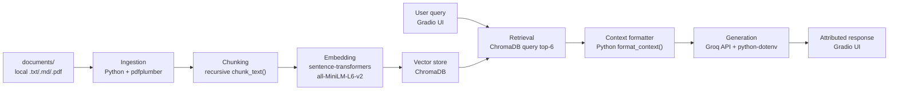

# Project 1 Planning: The Unofficial Guide

> Write this document before you write any pipeline code.
> Your spec and architecture diagram are what you'll use to direct AI tools (Claude, Copilot, etc.) to generate your implementation — the more specific they are, the more useful the generated code will be.
> Update the Retrieval Approach and Chunking Strategy sections if you change your approach during implementation.
> Update this file before starting any stretch features.

---

## Domain

International students navigating CPT, OPT, STEM OPT, and related paperwork face dense official policy that doesn't explain real-world timing, common mistakes, or what peers did when their situation didn't match the FAQ. University ISS pages and government sites state the rules but leave gaps on filing workflow, processing times, and edge cases.

This system deliberately combines two layers of information:
(1) **Official** — university ISS pages and government sources (USCIS, DHS/SEVIS, ICE) for policy and requirements;
(2) **Unofficial** — student-reported experiences from forums, Reddit, and peer guides, plus professional immigration attorney commentary for edge cases official pages omit.

Every answer must identify which layer each claim comes from. Unofficial sources inform practical orientation only; official sources take precedence when they conflict. This guide is informational, not legal or immigration advice.

---

## Source Taxonomy

Every document in the corpus is tagged with exactly one **source type**. This tag is stored as chunk metadata at ingestion and surfaced in every generated response.

### Category 1: Official and Government

**Purpose:** Authoritative policy, eligibility rules, forms, and filing requirements.

**Includes:**

- USCIS, DHS Study in the States, ICE/SEVP, and NAFSA regulatory pages
- University ISS/OIS office web pages and PDF handouts (UNL and peer institutions)

**Trust level:** Highest for *what is required*. May be vague on *how long things take* or *what students actually experience*.

**Subtypes (metadata `source_subtype`):** `government`, `university_iss`

---

### Category 2: Unofficial — Community & Professional Commentary

**Purpose:** Practical filing reality, timelines, mistakes, workarounds, and questions official pages don't answer.

**Includes:**

- Reddit and other student forums (r/intlstudents, r/f1visa, r/OPT, school subreddits)
- Peer blogs and "how I applied" guides
- Immigration attorney blogs (professional commentary — not government policy)

**Trust level:** Useful for *process insight and common pain points*. Never treated as legal or policy authority. May be outdated or school-specific.

**Subtypes (metadata `source_subtype`):** `student_forum`, `attorney_commentary`, `peer_guide`

---

### Source metadata fields (set at ingestion)

| Metadata field | Example | Purpose |
| ---------------- | ------------------------------------------------------------------------------------ | -------------------------------------- |
| `source_type` | `government` \| `university` \| `attorney` \| `student_forum` | Authority tier — required on every chunk |
| `source_subtype` | `USCIS`, `DHS-SEVP`, `ICE`, `ISS`, `law-firm`, `reddit` | Finer provenance for citation labels |
| `source_name` | USCIS — OPT for F-1 Students | Human-readable citation label |
| `source_url` | https://www.uscis.gov/.../optional-practical-training-opt-for-f-1-students | Clickable attribution |
| `source_date` | 2025-11 | Freshness; rules change over time |
| `original_filename` | uscis_opt_f1.md / i-765instr.pdf | Trace back to ingested file |
| `phase` | `standard-OPT` \| `STEM-OPT` \| `CPT` \| `general` | Keeps OPT and STEM OPT rules apart at retrieval time |
| `section_title` | Self-employment | Locates chunk inside long government pages |

**Response labeling map:** `government` and `university` → **Official guidance** in generated answers; `attorney` and `student_forum` → **Unofficial** (professional commentary or student-reported experience).


**Corpus composition:** Tier 1 (USCIS/DHS/ICE/NAFSA) and Tier 2 (university ISS) are tagged `official`. Tier 3 (attorney blogs) and student forums are tagged `unofficial`, with subtype `attorney_commentary` or `student_forum` so the model never presents attorney blogs as government rules or Reddit posts as policy.

**Corpus balance target:** ~40% official government, ~25% university ISS (including UNL when added), ~15% attorney commentary, ~20% student forums.

---

## Documents

Aim for at least 10 sources covering CPT, OPT, STEM OPT, and paperwork — with a **mix of both source types** (minimum 3 official government, minimum 5 unofficial when student sources are added).


| #     | Source                                                              | Source type | Description                                                                                                                                 | URL or location                                                                                                                                                                                                                                                                                                |
| ----- | ------------------------------------------------------------------- | ----------- | ------------------------------------------------------------------------------------------------------------------------------------------- | -------------------------------------------------------------------------------------------------------------------------------------------------------------------------------------------------------------------------------------------------------------------------------------------------------------- |
| 1     | USCIS — OPT for F-1 Students                                        | official    | Core federal guidance on OPT eligibility, types (pre/post-completion), application basics, and work authorization limits for F-1 students.  | [https://www.uscis.gov/working-in-the-united-states/students-and-exchange-visitors/optional-practical-training-opt-for-f-1-students](https://www.uscis.gov/working-in-the-united-states/students-and-exchange-visitors/optional-practical-training-opt-for-f-1-students)                                       |
| 2     | USCIS — STEM OPT Extension                                          | official    | Rules for the 24-month STEM OPT extension, including eligibility, employer requirements, and reporting obligations.                         | [https://www.uscis.gov/working-in-the-united-states/students-and-exchange-visitors/optional-practical-training-extension-for-stem-students-stem-opt](https://www.uscis.gov/working-in-the-united-states/students-and-exchange-visitors/optional-practical-training-extension-for-stem-students-stem-opt)       |
| 3     | USCIS Policy Manual — Vol. 2, Part F, Ch. 5                         | official    | Detailed policy on practical training (CPT/OPT/STEM) — authoritative interpretation of how USCIS applies the rules.                         | [https://www.uscis.gov/policy-manual/volume-2-part-f-chapter-5](https://www.uscis.gov/policy-manual/volume-2-part-f-chapter-5)                                                                                                                                                                                 |
| 4     | DHS Study in the States — F-1 OPT (SEVIS Help Hub)                  | official    | SEVP/SEVIS-oriented OPT overview: student record updates, employment reporting, and OPT mechanics from the DHS student portal.              | [https://studyinthestates.dhs.gov/sevis-help-hub/student-records/fm-student-employment/f-1-optional-practical-training-opt](https://studyinthestates.dhs.gov/sevis-help-hub/student-records/fm-student-employment/f-1-optional-practical-training-opt)                                                         |
| 5     | DHS Study in the States — International Students & Entrepreneurship | official    | DHS guidance on self-employment, startups, and entrepreneurship while on F-1 practical training — fills gaps many ISS pages skip.           | [https://studyinthestates.dhs.gov/international-students-and-entrepreneurship](https://studyinthestates.dhs.gov/international-students-and-entrepreneurship)                                                                                                                                                   |
| 6     | DHS — Form I-983 Overview                                           | official    | Explains the STEM OPT training plan (Form I-983): who completes it, what it must include, and how it ties to the STEM extension.            | [https://studyinthestates.dhs.gov/stem-opt-hub/additional-resources/form-i-983-overview](https://studyinthestates.dhs.gov/stem-opt-hub/additional-resources/form-i-983-overview)                                                                                                                               |
| 7     | USCIS — Form I-765 Instructions (PDF)                               | official    | Official instructions for the Application for Employment Authorization — required documents, fees, photos, and filing details for OPT.      | [https://www.uscis.gov/sites/default/files/document/forms/i-765instr.pdf](https://www.uscis.gov/sites/default/files/document/forms/i-765instr.pdf)                                                                                                                                                             |
| 8     | ICE — OPT "Directly Related to Major" Guidance (PDF)                | official    | ICE/SEVP guidance on what "directly related to the student's major" means for OPT employment — key for job eligibility questions.           | [https://www.ice.gov/doclib/sevis/pdf/optDirectlyRelatedGuidance.pdf](https://www.ice.gov/doclib/sevis/pdf/optDirectlyRelatedGuidance.pdf)                                                                                                                                                                     |
| 9     | NAFSA — 8 CFR 214.2(f) Regulatory Text                              | official    | Underlying federal regulation for F-1 student status and employment — legal baseline behind CPT/OPT rules.                                  | [https://www.nafsa.org/regulatory-information/8cfr2142f](https://www.nafsa.org/regulatory-information/8cfr2142f)                                                                                                                                                                                               |
| 10    | DHS — OPT Unemployment Counter                                      | official    | Explains the 90-day (standard OPT) and 150-day (STEM) unemployment limits and how unemployment days are counted in SEVIS.                   | [https://studyinthestates.dhs.gov/sevis-help-hub/student-records/fm-student-employment/unemployment-counter](https://studyinthestates.dhs.gov/sevis-help-hub/student-records/fm-student-employment/unemployment-counter)                                                                                       |
| 11    | USC OIS — Post-Completion OPT                                       | official    | Plain-language university ISS walkthrough of post-completion OPT: eligibility, timelines, and school-specific process steps (USC).          | [https://ois.usc.edu/employment/employment-f1/opt/post-completion-opt/](https://ois.usc.edu/employment/employment-f1/opt/post-completion-opt/)                                                                                                                                                                 |
| 12    | Yale OISS — OPT Description & Eligibility                           | official    | University ISS eligibility checklist and OPT overview in accessible language (Yale).                                                        | [https://oiss.yale.edu/employment-taxes/employment-for-international-students/f-1-students/optional-practical-training/opt-description-and-eligibility](https://oiss.yale.edu/employment-taxes/employment-for-international-students/f-1-students/optional-practical-training/opt-description-and-eligibility) |
| 13    | UC Berkeley International Office — OPT                              | official    | Berkeley ISS guide to OPT application flow, deadlines, and student responsibilities.                                                        | [https://internationaloffice.berkeley.edu/students/employment/opt](https://internationaloffice.berkeley.edu/students/employment/opt)                                                                                                                                                                           |
| 14    | BU ISSO — 24-Month STEM OPT Employment Types                        | official    | Defines what counts as valid STEM OPT employment (employer types, reporting) — useful for "does this job qualify?" questions.               | [https://www.bu.edu/isso/employment-internships/student-off-campus-work-and-training/24-month-stem-opt/employment-types/](https://www.bu.edu/isso/employment-internships/student-off-campus-work-and-training/24-month-stem-opt/employment-types/)                                                             |
| 15    | RJ Immigration Law — Self-Employment on OPT/STEM OPT                | unofficial  | Immigration attorney analysis of whether and how F-1 students can be self-employed on OPT or STEM OPT — edge case beyond standard ISS FAQs. | [https://rjimmigrationlaw.com/resources/can-i-be-self-employed-on-opt-or-stem-opt/](https://rjimmigrationlaw.com/resources/can-i-be-self-employed-on-opt-or-stem-opt/)                                                                                                                                         |
| 16    | Berardi Immigration Law — F-1 Business on OPT/STEM                  | unofficial  | Attorney guide on starting a business while on OPT/STEM OPT — startup, EIN, and self-employment considerations.                             | [https://berardiimmigrationlaw.com/f1-students-start-business-opt-stem/](https://berardiimmigrationlaw.com/f1-students-start-business-opt-stem/)                                                                                                                                                               |
| 17    | Pandev Law — Employment-Based Immigration for F-1 Students          | unofficial  | Attorney overview of employment pathways and work authorization options for F-1 students beyond basic OPT/CPT summaries.                    | [https://www.pandevlaw.com/blog/employment-based-immigration-f1-students/](https://www.pandevlaw.com/blog/employment-based-immigration-f1-students/)                                                                                                                                                           |
| 18    | UNL ISS — CPT                                                       | official    | *To add:* UNL-specific CPT application steps, required documents, and DSO process.                                                          | TBD                                                                                                                                                                                                                                                                                                            |
| 19    | UNL ISS — OPT / STEM OPT                                            | official    | *To add:* UNL-specific OPT request workflow and local deadlines.                                                                            | TBD                                                                                                                                                                                                                                                                                                            |
| 20    | DHS Study in the States — F-1 CPT                                   | official    | *To add:* Federal CPT rules and SEVIS mechanics.                                                                                            | TBD                                                                                                                                                                                                                                                                                                            |
| 21–25 | Student forum sources (Reddit, etc.)                                | unofficial  | *To add:* 5+ threads on OPT timelines, CPT processing, I-765 mistakes, STEM I-983, unemployment — student-reported experience layer.        | TBD                                                                                                                                                                                                                                                                                                            |


**Local file organization (when saved to `documents/`):**

- `documents/official/government/` — sources 1–10
- `documents/official/university_iss/` — sources 11–14, 18–19
- `documents/unofficial/attorney/` — sources 15–17
- `documents/unofficial/student_forum/` — sources 21–25

---

## Chunking Strategy

**Chunk size:** 256 tokens (~1,000 characters)

**Overlap:** 64 tokens (~25%, ~250 characters)

**Reasoning:**

The embedder, `all-MiniLM-L6-v2`, has a hard 256-token limit. Text past that point is dropped before it ever gets embedded, so a 512-token chunk would lose half its content silently. Setting chunk size to 256 fills that window without truncation.

The documents are mixed: dense USCIS and 8 CFR legal text, university advising FAQs, and law-firm articles. Their facts are conditional — a rule reads "X is allowed provided that A, B, and C." Split a rule from its conditions and the retriever can return "X is allowed" without the part that qualifies it, which is wrong and, in this domain, harmful. Smaller chunks split rules more often, so overlap goes up to 25% (instead of the usual 10–15%) to carry trailing conditions across the cut.

The splitter is **recursive and structure-aware**: it breaks on headings first, then paragraphs, then sentences, and falls back to character splits only when nothing else fits. Retrieval pulls the **top 6 chunks** so a full rule can be rebuilt from adjacent pieces.

The main domain-specific risk is **OPT and STEM OPT rules bleeding into each other** — e.g. self-employment is allowed on standard OPT but barred on STEM OPT, same words, opposite rule. The `phase` metadata tag separates the two at retrieval time.

**Metadata preserved per chunk** (never stripped before embedding or generation; travels with the chunk into Chroma and into the LLM context block):

| Field | Example | Purpose |
| ----- | ------- | ------- |
| `source_type` | government / university / attorney | Authority tier |
| `source_subtype` | USCIS / DHS-SEVP / ICE / ISS / law-firm | Finer provenance |
| `source_name` | USCIS — OPT for F-1 Students | Citation label |
| `source_url` | https://www.uscis.gov/.../optional-practical-training-opt-for-f-1-students | Clickable attribution |
| `source_date` | 2025-11 | Freshness; the rules change |
| `original_filename` | uscis_opt_f1.md / i-765instr.pdf | Trace back to the ingested file |
| `phase` | standard-OPT / STEM-OPT / CPT / general | Keeps OPT and STEM rules apart |
| `section_title` | Self-employment | Locates the chunk inside long government pages |

---

## Retrieval Approach

**Embedding model:** `all-MiniLM-L6-v2` via `sentence-transformers==3.4.1` — matches the 256-token chunk ceiling; local, no API cost.

**Top-k:** 6 — sized to reconstruct conditional rules split across adjacent chunks; pairs with 25% overlap.

**Production tradeoff reflection:**

If cost were not a constraint, I would weigh: (1) **domain jargon** — CPT, OPT, STEM, I-765, SEVIS abbreviations may embed poorly in a general-purpose model; a legal or immigration-fine-tuned embedder could improve retrieval on dense 8 CFR text; (2) **context length** — longer-context embedders (e.g. `e5-large`, domain-specific models) could use larger chunks and reduce the conditional-split risk that drives 25% overlap; (3) **latency** — MiniLM is fast and runs locally, important for interactive queries; heavier models add seconds per query; (4) **multilingual support** — not critical for this English-only corpus, but would matter if student forum sources include non-English posts. For this project, MiniLM + small chunks + high overlap is the right cost/accuracy tradeoff.

---

## Source Attribution & Response Policy

### At retrieval time

- Each retrieved chunk includes metadata: `source_type`, `source_subtype`, `source_name`, `source_url`.
- When formatting context for the LLM, prefix each chunk clearly, e.g.:
  - `[OFFICIAL — USCIS OPT for F-1] ...`
  - `[OFFICIAL — Yale OISS] ...`
  - `[UNOFFICIAL — Attorney commentary, RJ Immigration Law] ...`
  - `[UNOFFICIAL — r/intlstudents, 2024] ...`

### At generation time

The system prompt must require the model to:

1. **Label sources by category** in every answer — separate **Official guidance** from **Student-reported experience** / **Professional commentary** (use those headings or inline tags).
2. **Prefer official sources** for eligibility, required documents, and deadlines stated as policy.
3. **Use unofficial sources** only for timing estimates, common mistakes, and edge-case workflows — always framed as "students report" or "based on community posts," not as fact.
4. **Flag conflicts** — if unofficial content contradicts official policy, state the official rule first, then note the conflicting anecdote and its source.
5. **Refuse to invent** — if retrieved context lacks support, say so; do not fill gaps from model knowledge.
6. **Include disclaimer** — responses are informational, not legal or immigration advice; user must confirm with their ISS/DSO.

### Example response structure

> **Official guidance:** [from USCIS/ISS chunks]
> **Student-reported experience:** [from Reddit/forum chunks]
> **Professional commentary:** [from attorney blog chunks, if used]
> **Sources:** [OFFICIAL] USCIS OPT page · [UNOFFICIAL] r/f1visa thread (2024)

### Verification

- For eval questions, check that the response correctly tags which chunks were official vs unofficial.
- At least 2 of 5 eval questions should require **both** source types to answer well (policy + practical layer).

---

## Evaluation Plan

| # | Question | Expected answer | Must cite |
|---|----------|-----------------|-----------|
| 1 | What does USCIS require for post-completion OPT eligibility? | Student must (a) be in valid F-1 status and have been enrolled full-time for at least one full academic year; (b) seek employment directly related to their major field of study; (c) obtain a DSO recommendation entered in SEVIS before filing Form I-765; (d) apply within the allowed filing window (up to 90 days before program end, no later than 60 days after); (e) not have already used 12 months of OPT at the same or higher education level; (f) not be eligible for post-completion OPT if they have already used 12 months of full-time CPT at that level. Standard post-completion OPT is up to 12 months. | Official — USCIS OPT (#1), Policy Manual (#3) |
| 2 | What training plan form is required for STEM OPT, and when must it be submitted? | Form I-983 (Training Plan for STEM OPT Students) must be completed by the student and employer. It documents the training plan, learning objectives, and how the position relates to the STEM degree. It must be submitted to the DSO and entered in SEVIS within 60 days of the STEM OPT start date. Both student and employer sign the form. | Official — USCIS STEM OPT (#2), Form I-983 Overview (#6) |
| 3 | When should I apply for post-completion OPT relative to my program end date? | File Form I-765 up to **90 days before** the program end date listed on the I-20, and no later than **60 days after** the program end date. The DSO must recommend OPT in SEVIS and issue an updated I-20 with OPT recommendation before USCIS filing. The requested OPT start date must fall within the allowable period (generally within 60 days after program completion). | Official — USCIS OPT (#1), I-765 Instructions (#7) |
| 4 | What are the unemployment day limits on standard OPT vs STEM OPT? | **Standard OPT:** maximum **90 days** of unemployment during the initial 12-month OPT period. **STEM OPT:** an additional **60 days** of unemployment allowed during the 24-month extension, for a combined maximum of **150 days** across the entire OPT period (initial + STEM). Unemployment days are counted in SEVIS and accrue when the student has no qualifying employment. | Official — DHS Unemployment Counter (#10) |
| 5 | Can I be self-employed on OPT, and does the answer differ for STEM OPT? | **Official (DHS):** On standard OPT, self-employment may be permitted if the business is directly related to the student's degree and the student complies with OPT reporting requirements. **Official (STEM OPT rules):** STEM OPT requires a bona fide employer-employee relationship; self-employment is generally **not** permitted during the STEM extension. **Professional commentary (attorney blogs):** Attorneys note self-employment is a higher-scrutiny edge case even on standard OPT and requires careful documentation of the employer-employee relationship for STEM. The system must label each layer separately and state that DSO/USCIS confirmation is required. | Both — DHS Entrepreneurship (#5) as official; RJ Immigration (#15) and Berardi (#16) as unofficial attorney commentary |

**Grading notes:** A response passes if it includes the key facts above (not exact wording), cites the correct source layer, and does not state attorney commentary or student anecdotes as federal policy.

---

## Anticipated Challenges

1. **Official vs unofficial conflation** — The model merges a Reddit anecdote with USCIS policy into one authoritative-sounding answer. Mitigation: prefixed context blocks, structured response template, and eval questions that check for correct tagging.
2. **Outdated unofficial advice** — Forum posts from prior years may describe processing times or rules that have changed. Mitigation: include `source_date` in metadata; generation prompt warns that unofficial timing is anecdotal; prefer recent unofficial sources.
3. **School-specific vs general** — Peer university ISS pages (USC, Yale) and general r/f1visa advice may not match UNL's DSO process. Mitigation: label institution in metadata; add UNL ISS sources; prompt model to note when guidance is from another school.
4. **Attorney commentary vs policy** — Immigration blogs may interpret rules more broadly than conservative DSO practice. Mitigation: tag `attorney_commentary`; never present as official; recommend ISS confirmation.

---

## Architecture



| Stage | Tool / library | Component | Responsibility |
| ----- | -------------- | --------- | -------------- |
| Document ingestion | Python, `pdfplumber` (for PDFs) | `load_documents()` | Read files from `documents/`; assign `source_type`, `source_subtype`, `phase`, `source_name`, `source_url`, `source_date` from folder path + Documents table |
| Chunking | Python, `RecursiveCharacterTextSplitter` or custom | `chunk_text()` | 256-token chunks, 64-token overlap; structure-aware splits on headings → paragraphs → sentences; attach all metadata to every chunk |
| Embedding | `sentence-transformers==3.4.1` | `embed_chunks()` | Embed with `all-MiniLM-L6-v2`; store vectors + metadata in Chroma |
| Vector store | `chromadb>=0.6.0` | `build_index()` / `get_collection()` | Persist embeddings; expose filterable metadata (`phase`, `source_type`) |
| Retrieval | ChromaDB | `retrieve(query, k=6)` | Return top-6 chunks with metadata; optional `phase` filter for OPT vs STEM vs CPT queries |
| Context formatting | Python | `format_context()` | Prefix each chunk: `[OFFICIAL — USCIS OPT]` or `[UNOFFICIAL — RJ Immigration Law]` |
| Generation | `groq==0.15.0`, `python-dotenv` | `generate_answer()` | Send system prompt (Source Attribution policy) + formatted context to Groq; return labeled answer |
| Query interface | `gradio>=6.9.0` | `app.py` | Text input for question; display answer with source categories |

**Folder convention:**

```
documents/
  official/
    government/
    university_iss/
  unofficial/
    attorney/
    student_forum/
```

---

## AI Tool Plan

**Milestone 3 — Ingestion and chunking**

| | |
|---|---|
| **AI tool** | Cursor (Claude agent) |
| **Input** | Chunking Strategy section (256-token size, 64 overlap, recursive splitter), Source Taxonomy metadata fields, Documents table, folder convention, `requirements.txt` |
| **Prompt to produce** | `load_documents(directory)` — walks `documents/`, reads `.txt`/`.md`, uses `pdfplumber` for `.pdf`; assigns metadata from path and a sources manifest. `chunk_text(document, metadata)` — recursive structure-aware splitter with specified size/overlap; returns list of chunk dicts with all metadata fields including `phase` and `section_title`. `ingest.py` CLI entry point that prints 3 sample chunks. |
| **Verification** | Run `python ingest.py`; confirm 3 printed chunks show correct `source_type` (e.g. `government`), `phase` (e.g. `standard-OPT`), and non-empty `source_url`. Spot-check one USCIS chunk and one attorney chunk. |

**Milestone 4 — Embedding and retrieval**

| | |
|---|---|
| **AI tool** | Cursor (Claude agent) |
| **Input** | Retrieval Approach section (MiniLM, top-k=6), Architecture table, sample chunks from Milestone 3 |
| **Prompt to produce** | `embed_chunks(chunks)` — embed with `all-MiniLM-L6-v2`, upsert into ChromaDB collection with all metadata. `retrieve(query, k=6, phase=None)` — semantic search returning chunks + metadata; optional `phase` filter. `build_index.py` CLI that ingests all documents and builds the index. `test_retrieval.py` that runs eval Q4 ("unemployment day limits") and prints top-6 chunk titles + `source_name`. |
| **Verification** | Run retrieval for Q4; at least 2 of top-6 chunks must come from DHS Unemployment Counter (#10) with `phase` matching OPT. Run Q5 query; chunks must include both DHS Entrepreneurship (#5) and an attorney source (#15 or #16), not conflated. |

**Milestone 5 — Generation and interface**

| | |
|---|---|
| **AI tool** | Cursor (Claude agent) |
| **Input** | Source Attribution & Response Policy section, Evaluation Plan (all 5 Q&A), Architecture generation row, `.env.example` |
| **Prompt to produce** | `format_context(chunks)` — prefixes each chunk per attribution policy. `generate_answer(query, chunks)` — Groq API call with system prompt enforcing Official vs Unofficial headings, conflict handling, and disclaimer. `app.py` — Gradio interface: text box for question, button to query, markdown output with source list. `main.py` orchestrating retrieve → format → generate. |
| **Verification** | Run all 5 eval questions through the UI. Q1 must list eligibility criteria from official sources only. Q4 must state 90 / 150 unemployment days. Q5 must separate official DHS self-employment guidance from attorney commentary and note STEM OPT restriction. Each response must include a **Sources** line tagging `[OFFICIAL]` vs `[UNOFFICIAL]`. |